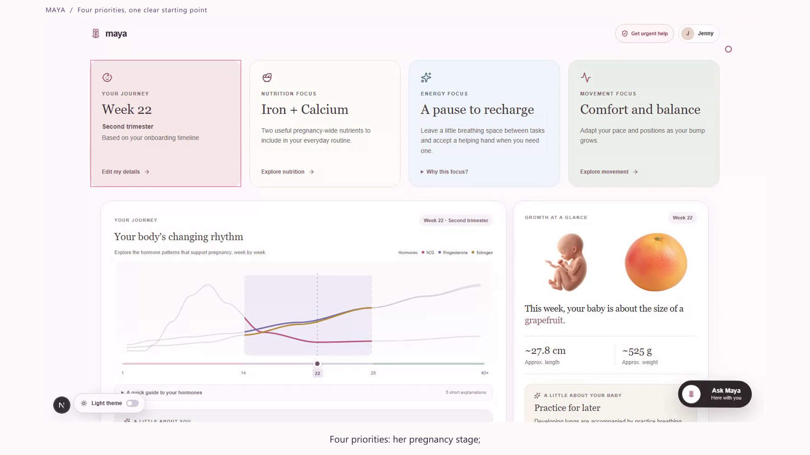
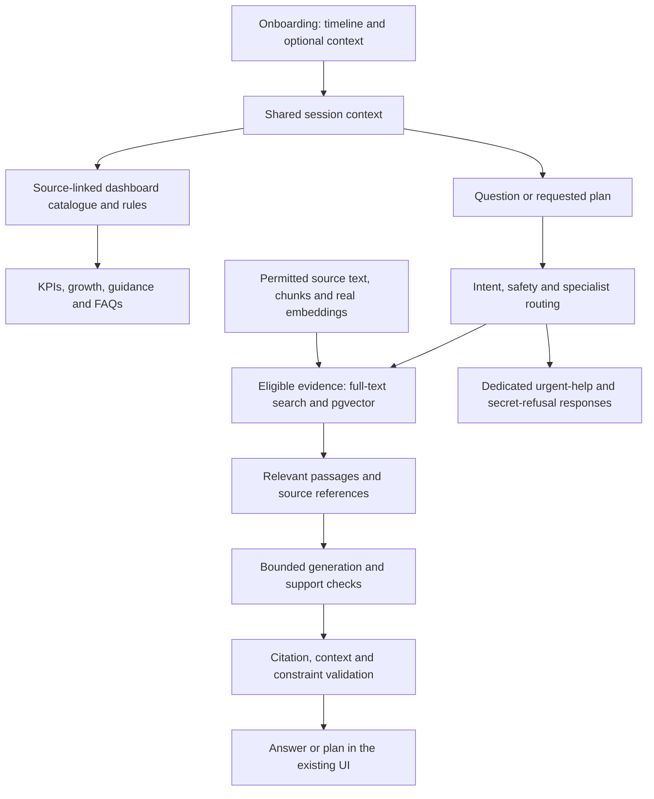

# Maya AI

**A maternal-health companion for expecting and new mothers.**

Pregnancy brings changing questions and advice from many places. Maya brings a mother's timeline,
preferences and concerns into one place to explore nourishment, movement, self-care and weekly plans.
**Ask Maya** carries that context into follow-up conversations with source references and safety boundaries.

**Maintained by Kajal Chourasia.** This repository starts with a fresh snapshot of the current Maya AI
project. Its [presentation artifacts](docs/FINAL-DELIVERABLES.md) and source provenance are preserved.

Current repository: **[kajalchourasia-cmd/maya-ai](https://github.com/kajalchourasia-cmd/maya-ai)**.
See the [repository transition and development baseline](docs/MAYA-REPOSITORY-TRANSITION.md).

## Watch, read and explore

| Final artifact | Open it |
|---|---|
| Two-minute product walkthrough | [Watch on Google Drive](https://drive.google.com/file/d/1ZPV1fXbu57OIT5IvDuibPqoZ0_IiEKDy/view?usp=sharing) · [MP4 in this repository](docs/demo/Maya-AI-Action-Walkthrough-Jenny-v2.mp4) |
| Final seven-slide presentation | [Download the PowerPoint](docs/presentation/Maya-Group-62-Final-7-Slide-Deck.pptx) |
| Product and AI architecture case study | [Read the Google Doc](https://docs.google.com/document/d/1fGPJMIXbeUL_AbEIdcTK5cko1oQyKI-Q-SUkE5TjQ3I/edit?usp=sharing) · [Current implementation and design differences](docs/MAYA-CURRENT-PROJECT-STATUS.md) |
| Presentation speaker notes | [Kajal and Aswath's running order and script](docs/presentation/Maya-Group-62-Presenter-Script.md) |
| Recorded demo narration | [Timed transcript](docs/demo/TRANSCRIPT.md) · [English subtitles](docs/demo/Maya-Action-Walkthrough-English.srt) |
| All project documentation | [Documentation home](docs/README.md) · [Final artifact catalogue](docs/FINAL-DELIVERABLES.md) |

[](https://drive.google.com/file/d/1ZPV1fXbu57OIT5IvDuibPqoZ0_IiEKDy/view?usp=sharing)

*Dashboard from the final recording, using Jenny's synthetic week-22 profile. Click the image to watch.*

The Google case study documents the broader September 12 architecture. The final presentation and
recording are September 17 artifacts. The [current-status guide](docs/MAYA-CURRENT-PROJECT-STATUS.md)
explains the implemented path and remaining work rather than treating every design proposal as live.

## The product experience

| Step | What the mother sees | What connects it |
|---|---|---|
| Begin a journey | Pregnancy or postpartum; week, approximate month, due date or birth date | One resolved timeline shared across the experience |
| Add context | Optional diet preferences, allergies, symptoms and activity restrictions | Shared session context, with no silently inserted sample facts |
| Understand the week | Journey, nutrition focus, energy focus and movement focus | A versioned, source-linked dashboard catalogue and applicability rules |
| Explore growth and change | Illustrative hormone patterns, reference measurements and weekly facts | The existing week library; these are estimates, not personal hormone readings or scan results |
| Explore Maya | This Week, Nutrition, Movement, Symptoms, Self-love and FAQs | Stage context and applicable reported preferences/constraints |
| Build a plan | Balanced, nutrition, movement or wellbeing outlines in a Monday-to-Sunday view | Requested plan routing, evidence-backed generation and validation |
| Ask Maya | Questions, follow-ups and source references | Onboarding context, session history, retrieval and bounded generation |

The current UI has no sign-in or document-upload requirement. Refresh starts a fresh journey.
Energy prompts offer supportive suggestions rather than claiming to know how someone feels.
Plans contain practical suggestions; they do not claim to calculate a nutritionally complete menu.

## How Maya uses AI and evidence



The frontend uses **Next.js / React**, connected through a same-origin bridge to **FastAPI** and
the existing Python journey, safety and orchestration services. The connected private-development
runtime uses **local Supabase/PostgreSQL, pgvector and the configured OpenAI provider**.

Static dashboard content is not a fresh LLM call on every page load. Week-information questions can
use the catalogue; eligible guidance questions and plans use the connected retrieval/generation path.
Urgent concerns and requests for credentials take dedicated routes. Provider or evidence failures
are reported rather than silently replaced with fixture answers.

Read the [current architecture and implementation map](docs/MAYA-CURRENT-PROJECT-STATUS.md),
[agreed product specification](docs/MAYA-INTENDED-PRODUCT-EXPERIENCE-AND-DATA-FLOW-SPEC.md) and
[broader architecture design](<docs/Nestline updated architecture.md>).

## What the final demo demonstrates

The **119.77-second** recording follows onboarding, dashboard categories and a balanced weekly plan,
then shows five Ask Maya exchanges: allergy-aware guidance, a vegan follow-up, heartburn support,
urgent-help routing and refusal to reveal credentials.

The recording uses real UI actions and captured responses with a synthetic profile. Long processing
waits are shortened in the edit, so it is not a latency benchmark. The meal replies in that run are
less specific than requested; [the demo guide](docs/demo/README.md) records that limitation rather
than presenting a successful HTTP response as proof of answer quality.

## Run on your computer

Requirements: **Python 3.12**, **Node.js 22.13+** (CI uses 24), npm, **pnpm 11.19.0**, and Docker/Supabase
for the connected retrieval path.

```powershell
git clone https://github.com/kajalchourasia-cmd/maya-ai.git
Set-Location maya-ai
python -m venv .venv
.\.venv\Scripts\python.exe -m pip install -r requirements-dev.txt
pnpm install --frozen-lockfile
Push-Location frontend
npm ci
Pop-Location
```

A clone includes code, UI assets, migrations and the dashboard catalogue. It does **not** include
private credentials or a populated RAG database. Before live chat/plans, follow the
[backup and new-computer guide](docs/MAYA-BACKUP-AND-NEW-COMPUTER-GUIDE.md) to obtain and restore the
matching authorized private runtime. The [recovery catalogue](data/recovery/private-runtime-20260917.json)
identifies that snapshot without exposing its contents or key.

- Keep backend secrets in a locally ignored `.env`; never use browser-visible `NEXT_PUBLIC_*` variables for keys.
- Preserve the admission packet, cached vectors and provider spending ledger. Do not reset a ledger to bypass a budget limit.
- Restore only into a fresh dedicated database. Never reset an existing populated database to make a setup check pass.
- Development indexing and publication/clinical approval are separate. A restored database does not change source-review permissions.

With the database/services configured and ports 8000/5180 free:

```powershell
.\.venv\Scripts\python.exe -m scripts.start_maya_local_ui --execute-private-local --node (Get-Command node).Source
```

Open **http://127.0.0.1:5180/**. The launcher starts the local API and UI, keeps its operator token in
process memory and records logs under ignored `reports/local/`. It refuses occupied ports. This is
a local application setup, not a public deployment.

## Verification and observability

The latest recorded integration/recovery regression run passed **848 Python tests and 315 subtests**,
with **61 skipped**. The preceding integrated UI run passed **47 frontend tests**, lint, interaction
checks, TypeScript checks and the production build. Counts refer to those recorded runs, not to every
future checkout. [Verification records and their scope](docs/MAYA-CURRENT-PROJECT-STATUS.md#verification).

Local execution records track routing, evidence references, validation results, provider usage and
cost reservations. The project includes evaluation tooling, but does not claim a demonstrated hosted
LangSmith dashboard. Engineering checks are not clinical validation.

```powershell
.\.venv\Scripts\python.exe -m pytest -q
.\.venv\Scripts\python.exe -m scripts.check_secret_hygiene
Push-Location frontend
node --test tests/*.test.cjs
npm run lint
npm run check:interactions
npm run build
npm run typecheck
Pop-Location
```

GitHub Actions also checks stage contracts and isolated Supabase migration/API/upgrade behavior.
Private-artifact and infrastructure-dependent skips must remain visible. Paid live checks are separate.

## Next steps and boundaries

Immediate work includes more specific meal answers and wider evidence coverage, secure document
intake with user-confirmed extracted facts, and a consent-based human/clinician handoff. WhatsApp,
additional languages/voice and broader postpartum support are future directions.

Maya currently provides educational guidance through a locally operated development application.
It does not diagnose, prescribe, replace urgent care or claim clinical validation. Secure medical
upload, live clinician connections, durable authenticated user records in this UI, full publication
review and public deployment remain separate work.

## Find your way around

| Area | Entry point |
|---|---|
| Documentation and final submission | [Docs home](docs/README.md) · [Final deliverables](docs/FINAL-DELIVERABLES.md) |
| Product UI | [frontend/](frontend/) |
| API and connected runtime | [api/main.py](api/main.py) · [grounded runtime](app/services/grounded_runtime.py) |
| Retrieval and indexing | [development retrieval](app/services/development_retrieval.py) · [corpus indexing](app/services/corpus_indexing.py) |
| Dashboard content | [data/dashboard/](data/dashboard/) · [presentation rules](app/services/product_presentation.py) |
| Database contracts | [supabase/migrations/](supabase/migrations/) · [SQL tests](supabase/tests/) |
| History and naming | [Historical report index](docs/HISTORICAL-REPORT-INDEX.md) · [Brand naming](docs/BRAND-NAMING.md) |

**Maya AI** is the project, **Maya** the companion, and **Ask Maya** the chat experience.
The current repository is `maya-ai`. Audited legacy identifiers, Supabase project identifiers and
historical filenames may retain `nestline` to preserve compatibility. The original collaborative
repository remains available at [nestline](https://github.com/kajalchourasia-cmd/nestline).
