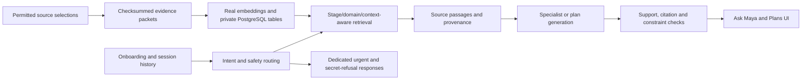

# Maya AI: current implementation and architecture

**Updated 17 September 2026.** This page reconciles the current code with the broader case study,
final deck and dated engineering records. It does not replace those historical records.

## What is connected today

The primary interface is the existing Next.js/React product UI. It connects through a same-origin
server bridge to FastAPI and the Python services. The old Streamlit application remains as historical
engineering work rather than a second main UI.

Onboarding establishes pregnancy/postpartum timing and optional diet, allergy, symptom and movement
context. The current journey needs no login and has no medical-document upload step. Session context
feeds the dashboard and conversation; a refresh starts a new journey instead of restoring private health facts.

| Surface | Information source | Important distinction |
|---|---|---|
| Journey KPI and trimester | Resolved onboarding timeline | Approximate month input must not become a falsely exact week |
| Nutrition, energy and movement focus | Versioned dashboard catalogue and applicability rules | Encouraging guidance, not measured hormones or a mood prediction |
| Growth comparison and reference measurements | Existing week library | Educational estimates, not the individual's scan results |
| Weekly facts, nutrition/movement/symptom/self-love cards and FAQs | Source-linked dashboard data with context/presentation rules | Dashboard rendering is not a fresh RAG call on every card |
| General week-information replies | Applicable catalogue information | Not every chat intent needs generation |
| Eligible guidance answers and requested plans | Real private-development retrieval, orchestration, generation and validation | No silent fixture replacement when retrieval or a provider fails |
| Urgent and credential requests | Dedicated safety/security routes | They must not disclose secrets or wait on ordinary plan generation |

## Retrieval and orchestration path

The active packet contains 98 evidence records and 98 real cached embeddings. The database snapshot
contains 194 of each because it preserves the earlier 96-record version too. That is not 194 unique
active passages. Embeddings use `text-embedding-3-small`, 1536 dimensions.

The runtime reuses Stage 5 hybrid retrieval, Stage 6 safety and Stage 7 routing/catalogue logic.
The configured live generation path uses the verified provider adapter; it does not imply all eight
specialists in the wider design run on every request. Operator-only development indexing stays separate
from published-content permissions. No clinical approval is inferred from a vector or passing software test.

Code entry points: [grounded runtime](../app/services/grounded_runtime.py),
[development retrieval](../app/services/development_retrieval.py),
[orchestration](../app/services/orchestration.py),
[dashboard guidance](../app/services/dashboard_guidance.py),
[presentation rules](../app/services/product_presentation.py).

## Observability

Local execution records expose route selection, source references, validation outcomes, provider
receipts, response timing and cost reservations. Budget ledgers persist locally and belong in the
private recovery package. Do not publish raw request logs or reset spending history.

The architecture includes broader evaluation/observability integrations. Current evidence does not
establish a demonstrated hosted LangSmith monitoring dashboard or a production support operation.

## Verification

| Recorded scope | Result | Reference |
|---|---|---|
| Local final-demo-era regression | 847 tests, 315 subtests passed; 44 skipped | [Recorded dashboard/plan verification](MAYA-PLAN-FIX-AND-COMPACT-DASHBOARD-20260917.md) |
| Combined integration plus recovery tooling | 848 tests, 315 subtests passed; 61 skipped | [Integration review record](MAYA-RELEASE-INTEGRATION-20260917.md) |
| Integrated frontend | 47 tests passed; lint, interaction checks, TypeScript and production build passed | [Integration review record](MAYA-RELEASE-INTEGRATION-20260917.md) |
| Final recorded UI sequence | Balanced seven-day plan plus five chat exchanges completed; retrieval/generation evidence recorded for applicable routes | [Demo guide](demo/README.md) |
| Private database recovery | Fresh dump restored in an isolated container; content fingerprints, vector search and private-table restrictions passed | [Recovery catalogue](../data/recovery/private-runtime-20260917.json) |

These runs have different scopes and environments. Keep skipped tests visible; do not combine their
counts into a claim about clinical accuracy. Check GitHub Actions for the actual commit being reviewed.
Updating these docs does not constitute a new live-model or whole-app test.

The recorded meal answer gave a general nutrient overview rather than the requested detailed meal
options; the vegan follow-up gave food groups rather than recipes. That is an answer-specificity gap,
even though the requests completed and returned source/context metadata.

## How to read the Google Doc and deck

The [Google case study](https://docs.google.com/document/d/1fGPJMIXbeUL_AbEIdcTK5cko1oQyKI-Q-SUkE5TjQ3I/edit?usp=sharing)
was last modified on September 12 and describes a broader system: authenticated workspaces,
personal records, proposed facts, state commits, graph relationships and review workflows.
Those design elements and historical services should not be confused with what the current record-free UI exposes.

The September 17 deck preserves the presentation narrative and its dated evaluation counts.
This page is the current implementation companion; the older architecture and audit files remain intact.

## What remains planned or unverified

- More specific meal answers, broader evidence coverage and evaluations on more real-world questions.
- Secure medical-document upload/extraction, with user confirmation before extracted facts affect guidance.
- An actual consent-based human/clinician handoff; urgent help must never wait in a review queue.
- Durable authenticated user state in the primary UI, public deployment, clinical/publication review and operational support.
- WhatsApp, more languages/voice and broader postpartum support.
- A complete application restore/run on a second computer and verification of an off-device backup copy.

The project is a locally operated educational development application. The final recording and
engineering results are not a clinical deployment claim.
