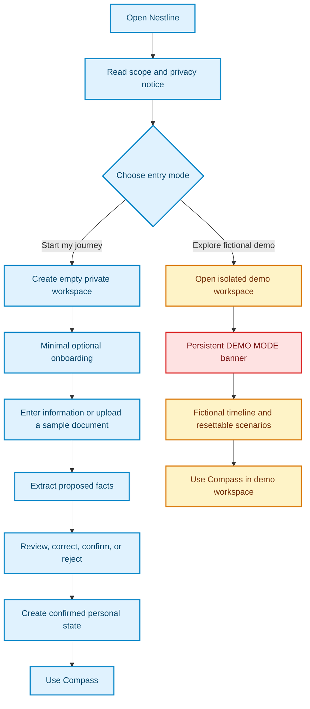
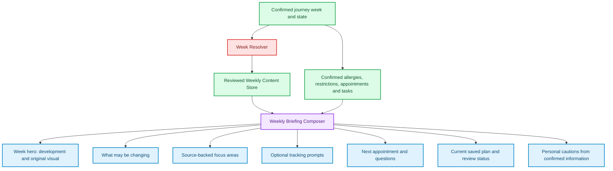
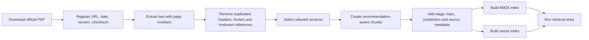
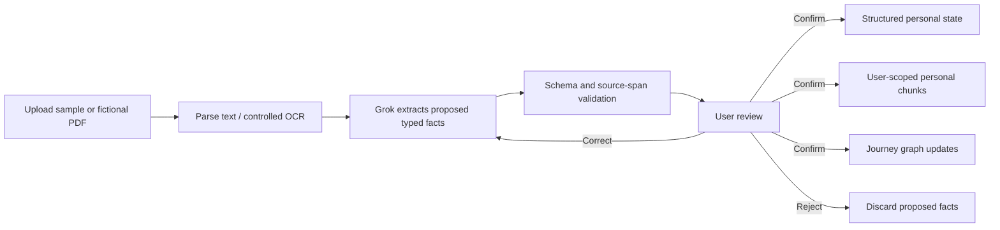
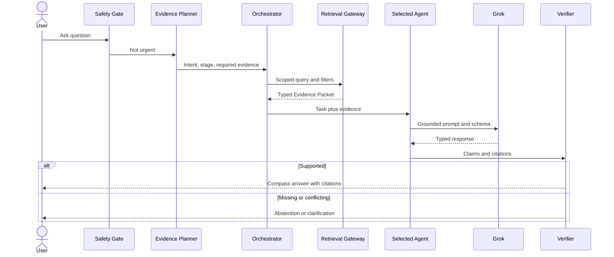
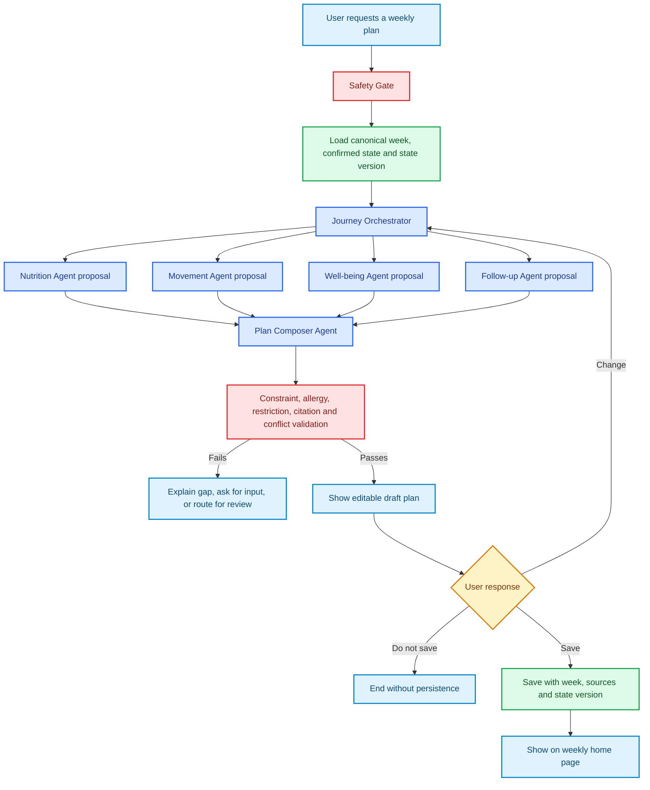

# Nestline — Product and Technical Source of Truth

**Product:** Nestline<br>
**Assistant:** Compass<br>
**Status:** Pre-implementation planning<br>
**Last updated:** 9 September 2026<br>
**Scope:** Pregnancy confirmation through 12 weeks postpartum<br>
**Language:** English only<br>
**Geographic context:** India, with clearly labeled global supplementary guidance

> **Superseded on 9 September 2026.** This file is retained as decision history. The canonical specification is now [Nestline — Updated Product and AI Architecture](<../Nestline updated architecture.md>).

---

## 1. What we are building

Nestline is a week-led, chat-supported maternal continuity assistant for pregnancy through 12 weeks postpartum. Its assistant, Compass, helps a user understand the current week, organize information they intentionally provide, understand what their records document, ask general questions against governed public guidance, create reviewable weekly plans, find appropriately filtered movement resources, prepare follow-up questions, and transfer uncertain or urgent situations to a human-oriented workflow.

Nestline is not a collection of independent wellness chatbots. Its central value is continuity: a confirmed change in a record should update the timeline, structured state, retrieval context, knowledge graph, eligible recommendations, follow-up tasks, and human handoff consistently.

### Prototype boundary

Nestline is a capstone prototype. It is not:

- A doctor or substitute for professional care.
- A diagnostic or treatment system.
- A medication-prescribing system.
- A clinical decision-support device.
- An emergency service.
- A clinically validated product.
- A production repository for real medical records.

The public prototype must instruct visitors not to upload real personal or medical information.

---

## 2. Problem statement

During pregnancy and early postpartum, important information is spread across prescriptions, visit summaries, reports, verbal instructions, appointments, educational resources, and different people. Users may struggle to remember what was documented, understand what changed, find guidance relevant to their current stage, and know when a question requires professional help rather than another generic chatbot answer.

Nestline creates a source-grounded continuity layer. It keeps personal records separate from public guidance, preserves provenance and confirmation status, coordinates bounded specialist agents, and fails closed when information is urgent, conflicting, missing, or outside scope.

---

## 3. Primary users

### Primary user

A pregnant or recently postpartum person who wants one place to organize information, ask grounded questions, and prepare for follow-up care.

### Secondary users

- A trusted caregiver who receives only explicitly shared tasks or appointments. This is represented in the data model but is not a separate capstone interface.
- A simulated clinician/reviewer who receives consent-aware clarification packets. The capstone demonstrates the workflow, not a real clinical service.
- A project evaluator who uses an explicit fictional demo mode.

---

## 4. Locked product decisions

| Area | Decision |
|---|---|
| Interface | Mobile-first Streamlit web application |
| Interaction | Chat-first, supported by journey, source, document-review, and simulated clinician views |
| Default first-time experience | Empty personal workspace |
| Demonstration | Separate, explicitly labeled, resettable fictional Demo Mode |
| Canonical pregnancy timing | Confirmed gestational week or estimated due date; display month is derived, not independently entered |
| Weekly experience | Source-backed pregnancy week cards plus postpartum week cards; recommendations retain their true source applicability |
| Plans | User-requested draft plans that must be reviewed before saving and are versioned against week and journey state |
| Personal data for capstone | Synthetic/test information only; public users are warned not to upload real records |
| Public knowledge | Selected sections from authoritative public sources |
| Model | Grok behind a replaceable provider adapter, subject to API availability and evaluation |
| Orchestration | LangGraph state machine |
| Structured state | SQLite with SQLAlchemy |
| Semantic retrieval | Chroma persistent index |
| Lexical retrieval | BM25 |
| Retrieval combination | Reciprocal-rank fusion plus authority/relevance reranking |
| Journey graph | NetworkX persisted as node/edge JSON |
| Document parsing | PyMuPDF; OCR only for a controlled noisy fixture if available |
| Schemas | Pydantic |
| Tracing | Local JSON traces required; LangSmith additive when credentials are available |
| Fine-tuning | Not implemented unless a later repeated behavior failure justifies it |
| MCP | Not required for the capstone; internal typed tool contracts remain MCP-compatible |
| Live medical web search | Disabled |
| Real clinician integration | Not implemented; human workflow is visibly simulated |

---

## 5. New-user and demo modes

Synthetic test data and a preloaded synthetic user are different concepts. Synthetic fixtures are necessary for development, evaluation, and reproducible demonstration, but they must never appear as a new visitor's personal history.



### Minimal onboarding

Required or strongly encouraged:

- Pregnancy or postpartum status.
- Confirmed gestational week or estimated due date for pregnancy; delivery date for postpartum.
- Country/region for source filtering.
- Acceptance of product limitations.

Optional:

- Allergies.
- Current documented medications.
- Movement restrictions.
- Existing conditions the user wants considered.
- Upcoming appointments.
- Current concern.
- Sample/fictional document upload.

Symptoms are normally captured as time-stamped conversation events, not permanent onboarding facts.

The product must not ask the user to maintain a separate month value that can contradict the week. It stores the gestational week as the operational value and derives a friendly display such as `Week 10 · approximately Month 3`. If an uploaded document later provides a different dated estimate, Nestline shows the discrepancy and asks the user to confirm rather than silently recalculating the journey.

### Missing information is a valid state

If an allergy, medication, restriction, or stage has not been supplied, Nestline stores `not_provided`. It never interprets missing information as “none.”

### Canonical dating priority

1. A user-confirmed estimate from a dated clinical document.
2. A user-confirmed estimated due date.
3. A manually entered gestational week as a fallback.

If two inputs disagree, the state becomes `dating_conflict` until the user confirms the value to use. Nestline does not adjudicate clinical dating.

### Week 1–3 boundary

Pregnancy is commonly dated from the first day of the last menstrual period, so the earliest numbered weeks do not map neatly to a known embryo and most week-by-week consumer guides begin later. Nestline may explain this dating convention, but it must not invent a baby-size comparison or claim pregnancy-specific development for weeks unsupported by the selected source.

---

## 5A. Weekly home experience

The home page is not a generic dashboard. It is a weekly briefing assembled from two clearly separated layers:

1. **Weekly educational card:** reviewed, source-backed content for the exact pregnancy week or postpartum week.
2. **Personal continuity layer:** information derived from the user's confirmed records, current concerns, saved plans, appointments, and open questions.



### Weekly dashboard components

| Component | Source | Personalization rule |
|---|---|---|
| Week and display month | Confirmed journey state | Month is derived from week |
| Baby-development visual | Reviewed exact-week content | Pregnancy only; use an original/licensed visual and preserve source attribution |
| Size comparison | Exact-week reviewed source plus canonical measurement | Optional metaphor; never use a comparison for an unsupported week |
| What may be changing | Exact-week content | Wording uses “may,” not “you will” |
| This week's focus | Applicable guideline passages and care milestones | Show only claims whose applicability includes the current week |
| Personal cautions | Confirmed allergy, restriction, instruction, conflict, or user report | Never infer missing information |
| Next appointment | Structured personal state | Show only a recorded appointment; otherwise say none is recorded |
| Questions for next visit | Record conflicts, missing information, saved questions | Suggested questions are not medical instructions |
| Current plan | Saved plan matching active week and state version | Mark stale when the week or relevant state changes |
| Ask Compass | Chat | Uses the full safety, retrieval, agent, Grok, and verification pipeline |

### Weekly content record

```json
{
  "week_id": "pregnancy_week_10",
  "display_month": "approximately_month_3",
  "journey_stage": "pregnancy",
  "canonical_length_or_weight": null,
  "comparison_label": null,
  "development_summary": "...",
  "body_change_summary": "...",
  "common_experience_topics": [],
  "care_milestones": [],
  "general_focus_topics": [],
  "tracking_prompts": [],
  "source_passage_ids": [],
  "allowed_claims": [],
  "prohibited_inferences": [],
  "review_status": "candidate_or_reviewed",
  "reviewed_at": null
}
```

Pregnancy requires reviewed cards for supported weeks, expected to begin at week 4 and continue through week 40/41 based on the selected weekly source. Postpartum requires 12 weekly cards, but their medical content may use evidence ranges such as days 0–7 or weeks 2–6 when sources do not support a different recommendation every week.

### Product vision versus four-day capstone coverage

The production vision includes reviewed content across pregnancy weeks 4–40/41 and postpartum weeks 1–12. Creating, sourcing, reviewing, licensing, testing, and illustrating roughly 50 distinct cards is a substantial content-governance project and is not safe to imply as complete in four days.

For the capstone:

- Build the schema and week resolver for the complete journey.
- Create a coverage matrix for every week.
- Fully review representative cards for pregnancy weeks 5, 10, 22, 31, 36, and 40 plus postpartum weeks 1, 6, and 12.
- Use week 10 as the primary landing-page demonstration and week 31 for the restriction-change scenario.
- For an unreviewed exact week, show the week number and only broader guidance whose applicability range includes it. Display `Exact-week content is not yet reviewed` rather than borrowing another week's card.

This preserves the correct architecture and avoids falsely presenting incomplete content coverage as a finished medical product.

### A weekly interface does not mean weekly medical invention

The page may change every week through development, visuals, milestones, questions, and plan state. Nutrition, movement, and mental-well-being recommendations change only when the underlying source, personal record, or saved preference supports that change. If the same guidance applies across several weeks, Nestline should repeat or progressively disclose it rather than invent a difference.

### Traditional practices and “nuskhas”

Nestline must not place unverified home remedies in a proactive “do” list. A later `Traditions and home practices` experience may let a user ask about a practice and receive one of three evidence states: `supported_for_general_comfort`, `insufficient_evidence_or_uncertain`, or `potentially_unsafe_or_requires_professional_review`. The prototype should demonstrate abstention or an evidence check, not recommend a catalogue of remedies.

---

## 6. Complete architecture

The architecture separates source truth, ingestion, storage, retrieval, agent reasoning, deterministic controls, human responsibility, and evaluation.

```mermaid
flowchart TB
    subgraph L1["1 — Governed sources"]
        G1["WHO, NHM, ICMR-NIN and selected official guidance"]:::data
        P1["User-provided or synthetic personal documents"]:::data
        V1["Prototype-curated public video metadata"]:::data
        S1["Safety source material"]:::data
        H1["Product help content"]:::data
    end

    subgraph L2["2 — Ingestion and governance"]
        REG["Source registry and version control"]:::tool
        PARSE["PDF parser / controlled OCR"]:::tool
        CLEAN["Cleaning and section selection"]:::tool
        EXTRACT["Grok structured fact extraction"]:::model
        REVIEW["User confirmation of critical personal facts"]:::human
        CHUNK["Recommendation-aware chunking and metadata"]:::tool
    end

    subgraph L3["3 — Knowledge and state"]
        WEEKLY["Reviewed exact-week content cards"]:::data
        GRAG["Guideline chunks: BM25 + vector index"]:::data
        PRAG["User-scoped personal chunks: BM25 + vector index"]:::data
        SQL["Confirmed journey state in SQLite"]:::data
        KG["NetworkX journey graph"]:::data
        VC["Curated video catalogue"]:::data
        FOOD["Structured food and meal-component catalogue"]:::data
        PLANS["Versioned saved-plan store"]:::data
        RULES["Deterministic safety rules"]:::data
        FAQ["Product-help collection"]:::data
    end

    subgraph L4["4 — Runtime controls"]
        USER["User message or upload"]:::ui
        SAFE["Safety Gate"]:::control
        PLAN["Intent and evidence planner"]:::control
        PERM["Permission and workspace gate"]:::control
        ORCH["Journey Orchestrator"]:::agent
        RET["Shared Retrieval Gateway"]:::tool
        PACK["Typed Evidence Packet"]:::tool
        BRIEF["Deterministic Weekly Briefing Composer"]:::tool
    end

    subgraph L5["5 — Bounded specialist agents"]
        REC["Record Agent"]:::agent
        MED["Medication Agent"]:::agent
        SYM["Symptom Navigation Agent"]:::agent
        NUT["Nutrition Agent"]:::agent
        MOV["Movement Agent"]:::agent
        VID["Video Agent"]:::agent
        WELL["Well-being Agent"]:::agent
        FUP["Follow-up Agent"]:::agent
        PLANAG["Plan Composer Agent"]:::agent
    end

    subgraph L6["6 — Model, verification, and outcomes"]
        GROK["Grok: grounded reasoning and language generation"]:::model
        VERIFY["Evidence and citation verifier"]:::control
        COMMIT["State Committer"]:::control
        ANSWER["Compass answer with citations"]:::ui
        ABSTAIN["Abstain or ask for clarification"]:::ui
        URGENT["Immediate external-care route"]:::control
        HANDOFF["Simulated human-review packet"]:::human
    end

    subgraph L7["7 — Observability and evaluation"]
        TRACE["Local and optional LangSmith traces"]:::eval
        CASES["Versioned development and holdout cases"]:::eval
        SCORE["Retrieval, agent, answer, safety, latency and cost metrics"]:::eval
    end

    G1 --> REG --> CLEAN --> CHUNK --> GRAG
    CHUNK --> WEEKLY
    REG --> FOOD
    H1 --> REG --> CLEAN --> CHUNK --> FAQ
    S1 --> REG --> RULES
    V1 --> REG --> VC
    P1 --> PARSE --> EXTRACT --> REVIEW
    REVIEW -->|"Confirmed passages"| PRAG
    REVIEW -->|"Confirmed facts"| SQL
    REVIEW -->|"Confirmed relationships"| KG

    USER --> BRIEF
    WEEKLY --> BRIEF
    SQL --> BRIEF
    PLANS --> BRIEF
    USER --> SAFE
    RULES --> SAFE
    SAFE -->|"Urgent"| URGENT --> HANDOFF
    SAFE -->|"Not urgent"| PLAN --> PERM --> ORCH
    ORCH --> RET
    GRAG --> RET
    PRAG --> RET
    SQL --> RET
    KG --> RET
    VC --> RET
    FOOD --> RET
    WEEKLY --> RET
    PLANS --> RET
    FAQ --> RET
    RET --> PACK
    PACK --> REC
    PACK --> MED
    PACK --> SYM
    PACK --> NUT
    PACK --> MOV
    PACK --> VID
    PACK --> WELL
    PACK --> FUP
    PACK --> PLANAG
    REC --> GROK
    MED --> GROK
    SYM --> GROK
    NUT --> GROK
    MOV --> GROK
    VID --> GROK
    WELL --> GROK
    FUP --> GROK
    PLANAG --> GROK
    GROK --> VERIFY
    VERIFY -->|"Supported"| ANSWER
    VERIFY -->|"Missing or conflicting"| ABSTAIN --> HANDOFF
    VERIFY -->|"Confirmed state mutation"| COMMIT --> SQL
    VERIFY -->|"User-approved plan"| PLANS
    COMMIT --> KG

    USER -.-> TRACE
    SAFE -.-> TRACE
    ORCH -.-> TRACE
    RET -.-> TRACE
    GROK -.-> TRACE
    VERIFY -.-> TRACE
    TRACE --> SCORE
    CASES --> SCORE

    classDef agent fill:#DBEAFE,stroke:#2563EB,color:#1E3A8A,stroke-width:2px;
    classDef data fill:#DCFCE7,stroke:#16A34A,color:#14532D,stroke-width:2px;
    classDef tool fill:#F3E8FF,stroke:#9333EA,color:#581C87,stroke-width:2px;
    classDef control fill:#FEE2E2,stroke:#DC2626,color:#7F1D1D,stroke-width:2px;
    classDef model fill:#E0E7FF,stroke:#4F46E5,color:#312E81,stroke-width:3px;
    classDef human fill:#FEF3C7,stroke:#D97706,color:#78350F,stroke-width:2px;
    classDef ui fill:#E0F2FE,stroke:#0284C7,color:#0C4A6E,stroke-width:2px;
    classDef eval fill:#F1F5F9,stroke:#475569,color:#0F172A,stroke-width:2px;
```



### Architecture principle

Grok is not the source of truth, database, retriever, safety gate, graph, or state writer. It receives a governed evidence packet after safety, permission, routing, and retrieval have run.

---

## 7. Evidence sources

### Evidence lanes

| Lane | Contains | May support | Must not become |
|---|---|---|---|
| Personal record | User-provided/synthetic documents and confirmed facts | “What do my records say?”, timeline, changes, follow-up preparation | General medical authority |
| Guideline | Selected passages from official public sources | General, cited education | Personalized diagnosis or treatment |
| Safety | Transparent categories mapped to official sources | Pre-generation urgent routing | Autonomous clinical triage |
| Media | Reviewed public-video metadata | Filtering within an already permitted activity category | Clinical evidence or clearance |
| Product help | Nestline usage instructions | How to use the application | Medical guidance |
| User report | Current message or manually entered information | Context and routing | Confirmed diagnosis |

### Initial authoritative corpus shortlist

`Approved for capstone prototype` means approved for a synthetic demonstration after section-level review. It does not mean clinically approved.

| ID | Source | Jurisdiction | Planned use | Status |
|---|---|---|---|---|
| `WHO-MATERNAL-2025` | [WHO recommendations on maternal health, edition 2](https://www.who.int/publications/b/59332) | Global | Current consolidated recommendation check | Primary candidate |
| `WHO-ANC-2016` | [WHO recommendations on antenatal care](https://www.who.int/publications/i/item/9789241549912/) | Global | Pregnancy nutrition, assessments, common physiological symptoms, care utilization | Primary candidate; link updates |
| `WHO-ANC-DAK` | [WHO Antenatal Care Digital Adaptation Kit](https://iris.who.int/bitstream/handle/10665/339745/9789240020306-eng.pdf) | Global | Workflows, data elements, decision-support structure | Architecture/data source |
| `WHO-PNC-2022` | [WHO recommendations on maternal and newborn postnatal care](https://www.who.int/publications/i/item/9789240045989) | Global | Postpartum assessment, support, contacts, continuity | Primary candidate |
| `WHO-PNC-DAK` | [WHO Postnatal Care Digital Adaptation Kit](https://www.who.int/publications/i/item/9789240090347) | Global | Postpartum workflow, data elements, decision support | Architecture/data source |
| `WHO-PERINATAL-MH` | [WHO perinatal mental-health integration guide](https://www.who.int/publications/i/item/9789240057142) | Global | Well-being boundaries, supportive language, service integration | Primary candidate |
| `ICMR-NIN-DGI-2024` | [Dietary Guidelines for Indians](https://www.nin.res.in/dietaryguidelines/pdfjs/locale/DGI07052024P.pdf) | India | Selected pregnancy/lactation nutrition sections | Primary India candidate |
| `WHO-PHYSICAL-ACTIVITY` | [WHO physical-activity guidelines](https://iris.who.int/bitstream/handle/10665/336656/9789240015128-eng.pdf) | Global | Selected pregnant/postpartum activity sections | Primary movement candidate |
| `NHM-MATERNAL-REGISTRY` | [NHM maternal-health guidelines](https://www.nhm.gov.in/index1.php?lang=1&level=3&lid=377&sublinkid=839) | India | Locate relevant India-specific documents and care pathways | Registry; select exact documents |
| `NHS-PREGNANCY-WEEKLY` | [NHS week-by-week pregnancy guide](https://www.nhs.uk/best-start-in-life/pregnancy/week-by-week-guide-to-pregnancy/) | United Kingdom | Exact-week development, body-change, action, and optional size-comparison source | Weekly-experience candidate; jurisdiction and reuse terms must be recorded |
| `CDC-HEAR-HER` | [CDC urgent maternal warning signs](https://www.cdc.gov/hearher/maternal-warning-signs/index.html) | United States | Transparent safety-test categories only | Supplementary, jurisdiction visible |

The short publication pages are not the corpus. The complete downloadable PDFs and selected sections are the corpus.

### Sources excluded from the permanent corpus

- Search-result snippets.
- Influencer posts and generic wellness blogs.
- Forums and community answers.
- Unrestricted web/X search results.
- Random YouTube transcripts.
- Commercial product pages.
- Medication-dose databases for autonomous advice.
- Real patient records.
- Sources whose version, publisher, or jurisdiction cannot be verified.

### Source-registry schema

```text
source_id
title
publisher
canonical_url
jurisdiction
publication_date
version_or_update
last_checked_at
document_type
journey_stage
topics
evidence_lane
selected_sections
allowed_use
prohibited_inferences
status
supersedes_source_id
license_or_reuse_note
reviewer_status
content_checksum
```

Allowed statuses:

```text
approved_for_capstone_prototype
candidate
excluded
superseded
```

Do not use `clinically_approved`.

---

## 8. Ingestion architecture

Ingestion converts a governed source into reliable retrieval or structured state. Guidelines and personal documents use different pipelines.

### Guideline ingestion



Guideline chunks should follow a recommendation or coherent passage, not an arbitrary character boundary. Each chunk preserves heading, page, source, applicability, and important qualifications.

Grok may help propose metadata during offline preparation, but it does not decide whether a public source is authoritative or whether a recommendation is true. Source selection and allowed-use decisions remain governed and reviewable.

### Personal-document ingestion



Critical facts cannot be committed silently. Extraction output must include source spans, page numbers, confidence, uncertainty, and potential conflicts.

### Fact statuses

| Status | Meaning | Runtime use |
|---|---|---|
| `not_provided` | No information supplied | Cannot be treated as “none” |
| `user_reported` | Manually entered by the user | May be used only with user-reported wording |
| `document_extracted` | Proposed by extraction | Not used as confirmed personal truth |
| `user_confirmed` | User approved the extracted fact | Available with provenance |
| `conflicted` | Sources disagree | Explain and route for clarification; do not resolve |
| `superseded` | Explicitly replaced by newer confirmed information | Historical use only |
| `human_reviewed` | Reviewer response recorded | Use with reviewer status visible |

---

## 9. Knowledge and storage design

### Shared retrieval platform, not one uncontrolled index

Nestline uses one Retrieval Gateway with separated collections and storage types:

```text
Retrieval Gateway
├── reviewed_weekly_content
├── guideline_chunks
├── user_scoped_personal_chunks
├── product_help_chunks
├── structured_journey_database
├── journey_graph
└── video_catalogue

Separate pre-generation store
└── deterministic_safety_rules
```

### Why not one independent RAG pipeline per agent?

| Option | Benefit | Cost/risk | Decision |
|---|---|---|---|
| Independent RAG per agent | Strong apparent domain separation | Duplicated ingestion, inconsistent versions, cross-domain difficulty, more failure points | Reject |
| One large unfiltered index | Easiest to build | Topic, stage, jurisdiction and evidence-lane confusion | Reject |
| Shared retrieval platform with separated collections and agent-scoped filters | Consistent governance, limited duplication, agent isolation, cross-domain support | Requires strict metadata and permission design | Use |

Each agent gets a specialized retrieval view, not unrestricted access to all knowledge.

### Stage metadata

```text
exact_week
applicable_week_start
applicable_week_end
pregnancy_trimester_1
pregnancy_trimester_2
pregnancy_trimester_3
postpartum_days_0_7
postpartum_days_8_42
postpartum_days_43_84
all_pregnancy
all_postpartum
all_stages
```

The exact week is stored in structured state. Retrieval first matches an exact reviewed weekly card, then retrieves any guideline passage whose week range includes the current week. Nestline does not invent week-specific guidance when a source only applies broadly.

### Hybrid RAG pipeline

1. Resolve the canonical journey week and identify required evidence lanes and topics.
2. Apply workspace, permission, confirmation, exact-week/applicable-range, stage, jurisdiction, topic, version, and source-status filters.
3. Query structured state for exact dates/statuses.
4. Run BM25 for exact names, phrases, dates, and instructions.
5. Run vector retrieval for semantically similar passages.
6. Query the graph only for temporal or relationship questions.
7. Filter the video catalogue only after movement eligibility exists.
8. Fuse and rerank results by relevance, authority, stage, and freshness.
9. Produce a typed Evidence Packet.
10. Generate only within that packet.
11. Verify claim-to-source support before display.

### Evidence Packet contract

```json
{
  "request_id": "...",
  "workspace_id": "...",
  "question": "...",
  "journey_stage": "...",
  "risk_result": "routine",
  "personal_facts": [],
  "personal_passages": [],
  "guideline_passages": [],
  "graph_paths": [],
  "eligible_media": [],
  "missing_information": [],
  "conflicts": [],
  "allowed_claim_types": [],
  "required_citations": []
}
```

---

## 10. Grok placement and model policy

Grok is the proposed language/reasoning model behind a provider adapter. The product architecture must remain replaceable if credentials, latency, cost, or evaluation results make another provider more appropriate.

### Grok is used for

1. Structured fact extraction from already parsed personal-document text.
2. Ambiguous intent classification when deterministic routing is insufficient.
3. Specialist-agent reasoning over a supplied Evidence Packet.
4. Clear response generation in a required schema.
5. Optional synthesis of multiple compatible agent outputs.

### Grok is not used for

- Deterministic urgent-pattern checks.
- Permission or workspace isolation.
- Selecting authoritative sources.
- PDF text extraction/OCR itself.
- BM25/vector retrieval.
- Exact database queries.
- Graph traversal.
- Video exclusion logic.
- State commits.
- Citation existence or schema validation.
- Unrestricted live medical web/X search.

### Model-call budget

| Request | Maximum planned Grok use |
|---|---:|
| Product FAQ | 0 calls where deterministic content exists |
| Urgent route | 0 calls before immediate safety response |
| Simple grounded question | 1 generation call |
| Ambiguous grounded question | 1 classification + 1 generation call |
| Document upload | 1 structured-extraction call before confirmation |
| Connected two-agent request | Up to 2 specialist calls + 1 synthesis call |

All calls produce typed output, source references, uncertainty, latency, token/cost metadata, and trace events.

---

## 11. Agent architecture

An agent is not just a prompt. Every agent has:

1. Trigger.
2. Typed input.
3. Allowed tools.
4. Retrieval policy.
5. Model instructions.
6. Typed output.
7. Prohibited behavior.
8. Stop/escalation conditions.
9. Call and retry budget.
10. Evaluation cases and trace output.

Agents communicate through typed shared state and Evidence Packets, not unrestricted conversations.

### Agent catalogue

| Agent | Purpose | Evidence/tools | Output | Must stop/escalate when |
|---|---|---|---|---|
| Journey Orchestrator | Select necessary agents and order | Intent, stage, permissions, agent registry | Route plan and reason | Safety blocks, unknown intent, tool or call budget exceeded |
| Record Agent | Extract what an uploaded document states | Parsed text, schema validator, conflict checker | Proposed facts, source spans, confidence, conflicts | Identity mismatch, critical low confidence, unsupported document type |
| Medication Agent | Summarize documented medication instructions | Confirmed structured facts, exact personal passages | Documented instruction/change/conflict summary | Instructions conflict, source missing, user asks for prescribing |
| Symptom Navigation Agent | Provide bounded education and route appropriately | Safety result, approved symptom passages, stage, recent user report | General information, uncertainty, next route | Urgent pattern, insufficient evidence, diagnosis/treatment request |
| Nutrition Agent | Provide stage-aware general education | Approved nutrition passages, stage, confirmed allergies/restrictions | Cited educational response | Treatment-diet request, missing essential personal filter, conflict |
| Movement Agent | Determine evidence-supported movement category | Movement guidance, stage, confirmed restrictions/instructions | Eligible category, exclusions, uncertainty | No basis for personalization, contraindication/restriction conflict |
| Video Agent | Select within eligible movement category | Curated catalogue, deterministic eligibility filter | One eligible video card or no result | No eligible item, source unavailable, restrictions exclude candidates |
| Well-being Agent | Provide supportive, non-diagnostic conversation | Approved well-being passages and user-approved context | Supportive response and human route | Urgent harm pattern, severe/persistent distress, therapy/diagnosis request |
| Follow-up Agent | Turn confirmed information into actions | Appointments, conflicts, open questions, reminders | Task or question list with source | Task depends on unconfirmed information |
| Plan Composer Agent | Combine compatible domain proposals into a reviewable weekly plan | Current week/state version plus typed outputs from Nutrition, Movement, Well-being and Follow-up Agents | Draft plan, assumptions, citations, conflicts, save eligibility | Any component fails validation, urgent state, unresolved restriction, missing required personalization |
| Human Review workflow | Transfer responsibility and resume a case | Consent-aware evidence packet, simulated reviewer console | Review request, response, resume/timeout state | Consent absent, urgent user is being asked to wait, packet is incomplete |

### What the specialist agents actually do

Agents do not own or independently ingest a corpus. Ingestion is a governed offline/system process. At runtime an agent performs four bounded operations:

1. Request a permitted evidence view from the Retrieval Gateway.
2. Apply its domain-specific reasoning contract to that evidence.
3. Propose a typed answer, plan component, task, or escalation.
4. Return provenance and uncertainty for independent validation.

The agent cannot directly commit personal state or saved plans. The State Committer or Plan Store performs writes only after validation and user confirmation.

### Nutrition Agent contract

The Nutrition Agent does not “know everything about nutrition” from model memory. It receives:

- Canonical pregnancy/postpartum week.
- Guideline passages applicable to that exact week or a containing range.
- Confirmed food allergies.
- User preferences such as vegetarian/non-vegetarian when supplied.
- Confirmed clinician-documented dietary restrictions.
- A curated India-relevant food/meal-component catalogue when plan creation is requested.

It may:

- Explain source-backed nutrition guidance.
- Propose a meal framework using catalogue items.
- Identify which personal filters changed the proposal.
- Ask for missing preferences.
- Produce a typed nutrition component for a weekly draft plan.

It may not diagnose deficiency, treat a condition, calculate a therapeutic diet, prescribe supplements, or infer that an unreported allergy does not exist.

### Movement Agent contract

The Movement Agent receives current week, applicable guideline passages, confirmed restrictions, documented movement instructions, preferences, and recent symptom context after Safety Gate processing. It proposes an eligible activity category and a typed weekly movement-plan component. Deterministic rules validate restrictions before the Video Agent may search the curated catalogue.

### Symptom Navigation Agent contract

The Symptom Navigation Agent receives a time-stamped user report, canonical week, safety result, applicable general guidance, and permitted confirmed context. It can provide general education, suggest what information to record, and create a care-team question. It cannot diagnose, estimate disease probability, or downgrade a deterministic urgent route.

### Well-being Agent contract

The Well-being Agent can propose a small, source-supported check-in or coping routine and a user-selected reminder. It is skipped on urgent harm-related language and cannot act as autonomous therapy.

### Follow-up Agent contract

The Follow-up Agent reads recorded appointments, unresolved conflicts, questions, and saved plan items. It creates organizational tasks and reminders, not medical instructions.

### Weekly Briefing Composer is not an agent

The weekly home page should load quickly and predictably. A deterministic service joins the reviewed weekly content card with confirmed personal state, appointments, open questions, and the current saved-plan status. It does not run every specialist agent whenever the page opens. Grok may be used only for an optional friendly summary after the underlying cards are assembled and validated.

### Common agent output

```json
{
  "agent": "movement_agent",
  "status": "completed_or_abstained_or_escalated",
  "summary": "...",
  "facts_used": [],
  "citations": [],
  "uncertainties": [],
  "proposed_actions": [],
  "state_changes": [],
  "requires_human_review": false,
  "stop_reason": null
}
```

---

## 12. Runtime flows

### Routine grounded question



### Urgent path

1. Safety Gate runs before the Orchestrator and Grok.
2. A transparent urgent pattern blocks routine agents.
3. The application shows a fixed immediate external-care route.
4. A consent-aware handoff packet is prepared in parallel.
5. The user is never asked to wait for the simulated clinician before seeking urgent help.

### Document-change path

1. User uploads a sample or fictional visit summary.
2. Parser extracts text.
3. Grok proposes typed facts and source spans.
4. Code validates schema, identity, date, and spans.
5. User confirms/corrects/rejects.
6. State Committer applies confirmed changes only.
7. Structured state, personal chunks, and graph update.
8. Conflict detector preserves unresolved medication disagreement.
9. Movement restriction invalidates a previously eligible video.
10. Follow-up task and simulated human-review packet are created.

### Weekly plan creation and saving

A weekly plan is a user-controlled organizational artifact, not an automatically prescribed care plan.



Plan lifecycle:

```text
draft → user_reviewed → saved → active → stale → replaced_or_archived
```

Every saved plan stores:

```text
plan_id
owner_id
journey_week
journey_state_version
created_at
user_preferences_used
confirmed_constraints_used
component_agent_outputs
source_passage_ids
user_edits
status
stale_reason
```

A plan becomes `stale` when the week rolls over or a relevant confirmed allergy, restriction, medication instruction, symptom state, appointment, or clinician response changes. Nestline explains what changed and asks whether to regenerate; it does not silently rewrite a saved plan.

### Personalized weekly content priority

When assembling either the dashboard or a plan, use this order:

1. Deterministic urgent/safety controls.
2. Confirmed clinician-documented restrictions and instructions.
3. Confirmed/user-reported allergies and relevant preferences, with their status visible.
4. Exact-week educational content.
5. Broader guideline passages whose applicability range includes the current week.
6. User choices and saved-plan feedback.
7. Model language generation.

Grok is last in this priority, not first.

---

## 13. Journey graph

GraphRAG is used for relationships and temporal change, not as a replacement for guideline retrieval.

### Core nodes

`User`, `Episode`, `Stage`, `Encounter`, `Document`, `Passage`, `MedicationInstruction`, `Allergy`, `Restriction`, `SymptomEvent`, `Appointment`, `Task`, `Guideline`, `Video`, `Handoff`, `ClinicianResponse`, and `AgentRun`.

### Core relationships

```text
User HAS_EPISODE Episode
Episode HAS_STAGE Stage
Episode HAS_ENCOUNTER Encounter
Encounter PRODUCED Document
Document DOCUMENTS Fact
NewInstruction CONFLICTS_WITH EarlierInstruction
ConfirmedInstruction SUPERSEDES EarlierInstruction
Restriction CONSTRAINS MovementClass
Restriction EXCLUDES Video
MovementClass SUPPORTED_BY GuidelinePassage
Task CLARIFIES Conflict
Handoff CONTAINS Task
ClinicianResponse RESOLVES Handoff
```

No node or edge is created because a model finds it plausible. It must come from confirmed personal information, a registered source, or an explicit workflow event.

### Questions GraphRAG should answer

- What changed after the latest visit?
- Why is a previous video no longer eligible?
- Which instructions conflict?
- Which open question is linked to the conflict?
- Which document supports the active restriction?

---

## 14. Video recommendation

The Video Agent searches a bounded, manually reviewed catalogue rather than unrestricted YouTube.

### Catalogue fields

```text
video_id
canonical_url
title
channel
creator_credentials_note
stage
activity_type
intensity
duration
equipment
position_or_movement_tags
eligibility_tags
exclusion_tags
stop_signs
rationale_source_ids
transcript_or_description_reviewed
approved_timestamps
reviewer_note
reviewed_at
review_expires_at
availability_status
```

Videos are labeled `prototype_curated`, never `clinically_approved`. If every candidate is excluded or required personal information is missing, Compass returns no video and explains why.

---

## 15. Human review

The capstone human-in-the-loop system demonstrates responsibility transfer, not access to an actual on-call doctor.

### Handoff packet

- User question and consent status.
- Risk result and reason.
- Confirmed personal facts only.
- Conflicts and missing information.
- Relevant source passages.
- Agent actions already taken.
- Exact clarification requested.
- Urgent external-care message already shown, when applicable.

### States

```text
not_required
offered
consented
queued
reviewed
resumed
declined
timed_out
```

The interface must visibly label the clinician console and responses as simulated.

---

## 16. Synthetic dataset policy

Synthetic data is retained for development, evaluation, automated tests, and Demo Mode. It is not loaded into normal user workspaces.

### Normal workspace

- Starts empty.
- Is scoped to the current authenticated/session-derived owner.
- Grows only from intentionally supplied information.
- Retrieves only records matching the server-enforced owner/workspace ID.

### Demo workspace

```json
{
  "workspace_id": "NESTLINE-DEMO",
  "is_demo": true,
  "is_fictional": true,
  "resettable": true,
  "allow_real_uploads": false
}
```

Every screen shows a Demo Mode banner. Every synthetic PDF is watermarked:

> SYNTHETIC CAPSTONE DATA — NOT A REAL MEDICAL RECORD

### Planned synthetic fixtures

| ID | Document | Purpose |
|---|---|---|
| `DOC-001` | Pregnancy intake summary | Starts the fictional episode |
| `DOC-002` | Baseline laboratory report | Tests structured extraction without diagnosis |
| `DOC-003` | Fictional prescription/instruction | Establishes an initial documented instruction |
| `DOC-004` | Routine visit summary | Updates stage without overwriting earlier facts |
| `DOC-005` | Fictional movement guidance note | Creates an initially eligible movement category |
| `DOC-006` | Later visit summary | Adds movement restriction and conflicting fictional instruction |
| `DOC-007` | Follow-up instruction | Creates appointment and clarification task |
| `DOC-008` | Postpartum discharge summary | Demonstrates stage transition and postpartum continuity |

Each fixture requires editable source text, watermarked PDF, and expected extraction JSON. One controlled noisy variant tests OCR/uncertainty.

---

## 17. Security and workspace isolation

Every personal object includes `owner_id`, `workspace_id`, `episode_id`, and provenance. The server derives owner/workspace scope from the authenticated session; the model cannot select or override it.

```text
Shared across users
├── Approved guideline collection
├── Product-help collection
├── Safety rules
└── Prototype-curated video catalogue

Isolated per workspace
├── Structured personal state
├── Personal-record chunks
├── Journey graph
├── documents
├── traces
└── handoffs
```

The repository, application, data, screenshots, traces, remotes, and video must contain no employer information, real medical information, secrets, API keys, or committed `.env` files.

---

## 18. Evaluation strategy

Evaluation begins before prompt tuning.

### Datasets

- 45 development cases.
- 15 sealed holdout cases.
- Fixed synthetic inputs and expected outputs.
- Versioned agent, prompt, model, retrieval, source, and evaluator configurations.

### Retrieval metrics

- Correct evidence lane.
- Retrieval recall at 5.
- Mean reciprocal rank.
- Correct stage/topic/jurisdiction filters.
- Citation precision and completeness.

### Agent metrics

- Router accuracy.
- Unnecessary-agent rate.
- Allowed-tool compliance.
- Typed-schema validity.
- Correct stop/escalation behavior.
- Agent-call and retry count.

### Answer metrics

- Claim faithfulness.
- Personal-record accuracy.
- Citation support.
- Correct abstention.
- No diagnosis or prescribing.
- Helpfulness and clarity.

### Safety metrics

- Urgent-pattern recall.
- Unsafe reassurance rate.
- Routine-agent blocking on urgent cases.
- Negation and contextual false-positive behavior.
- Correct external-route and handoff behavior.

### System metrics

- State-transition correctness.
- Graph-edge correctness and provenance.
- Video eligibility/invalidation correctness.
- Latency, model calls, tokens, estimated cost, and errors.

### Initial must-pass cases

1. Exact documented medication retrieval.
2. Personal/guideline lane separation.
3. Unsupported-question abstention.
4. Correct typed document extraction.
5. Lab report summarized without diagnosis.
6. Conflicting instructions detected and not resolved.
7. Unconfirmed facts excluded from confirmed state.
8. Confirmed restriction creates expected graph edge.
9. Initially eligible video is returned.
10. Later restriction invalidates the earlier video.
11. Urgent physical fixture skips routine agents.
12. Urgent mental-health fixture skips routine agents.
13. Low-confidence OCR field requires confirmation.
14. Wrong synthetic identity blocks ingestion.
15. Postpartum transition changes retrieval filters.
16. Week 10 retrieves the reviewed week-10 card and not a week-9 or week-16 card.
17. A broader recommendation is included only when its applicable range contains the current week.
18. Conflicting week/due-date information triggers confirmation rather than silent recalculation.
19. A confirmed food allergy excludes matching structured meal components.
20. An unprovided allergy is represented as unknown, not “no allergies.”
21. A weekly plan cannot be saved when a required component has an unresolved conflict.
22. A saved plan becomes stale after a relevant confirmed restriction changes.
23. Week rollover does not silently overwrite the user's saved plan.
24. Unsupported traditional-remedy questions abstain or route to evidence/professional review.

---

## 19. Project phases

| Phase | Objective | Main output | Exit gate |
|---|---|---|---|
| 0. Scope lock | Fix product, safety, audience, scenarios, and boundaries | This source of truth | Decisions are internally consistent |
| 1. Evidence and synthetic-data foundation | Decide exactly what the system may know and the correct expected outcomes | Source registry, selected sections, synthetic fixtures, ground truth, initial eval contract | Every planned answer/state change is traceable |
| 2. Scaffold and baseline harness | Establish isolated codebase and contracts | App skeleton, schemas, reset, tracing, mock mode, initial tests | Clean setup runs a traceable mock request |
| 3. RAG and document-to-state vertical slice | Prove one cited answer and one confirmed record update | Parser, hybrid retrieval, citations, Record Agent, State Committer | Answerable, unanswerable, and update cases pass |
| 4. Safety and orchestration | Add safety and bounded specialist routing | Safety Gate, Orchestrator, specialist nodes and budgets | Routine requests use only necessary agents; urgent requests skip generation |
| 5. Graph, video and human review | Make one confirmed change affect downstream behavior | Graph paths, eligibility/invalidation, handoff and resume | Scenario 2 passes end to end |
| 6. Evaluation-driven improvement | Measure, diagnose, improve and compare | Baseline, failure clusters, changed architecture/prompts, holdout | Measured improvement without hidden regressions |
| 7. Product completion and submission | Make the system understandable and repeatable | Final UI, README, scorecard, demo video and fallback | Three scenarios pass three consecutive reset runs |

### Four-day placement

- **Wednesday:** Complete Phase 1, Phase 2, and the smallest Phase 3 vertical slice.
- **Thursday:** Complete Phase 3 and Phase 4; begin Phase 5.
- **Friday:** Complete Phase 5 and Phase 6; finish product surfaces and documentation.
- **Saturday:** Acceptance, rehearsal, recording, editing, and submission only.

---

## 20. Current phase: evidence and synthetic-data foundation

No implementation should start until the following are complete:

- [ ] Freeze evidence lanes and source policy.
- [ ] Reopen every candidate source from its official publisher.
- [ ] Record publisher, URL, jurisdiction, date/version, status, allowed use, freshness, and licensing/reuse note.
- [ ] Select exact headings/pages/anchors for the initial corpus.
- [ ] Assign every selected passage a topic, stage, jurisdiction, allowed claims, prohibited inferences, and intended eval cases.
- [ ] Review the NHS week-by-week pregnancy pages and record exact-week content, canonical measurements, comparison labels, attribution/reuse terms, and safe paraphrases.
- [ ] Create the weekly content schema and coverage matrix for supported pregnancy weeks plus postpartum weeks 1–12.
- [ ] Label every recommendation with `applicable_week_start` and `applicable_week_end`; do not force broad guidance into a false exact-week claim.
- [ ] Define the canonical dating resolver and dating-conflict state.
- [ ] Freeze the fictional journey timeline.
- [ ] Specify all eight synthetic fixtures and expected extraction JSON.
- [ ] Define pre-confirmation and post-confirmation state.
- [ ] Define graph nodes, edges, and provenance for the three scenarios.
- [ ] Select and review 8–12 public-video candidates or deliberately reduce the catalogue if quality is insufficient.
- [ ] Define source-mapped safety fixtures including positive, negated, and ambiguous cases.
- [ ] Freeze the initial evaluation contract before prompts are tuned.
- [ ] Add week-selection, allergy-filtering, plan-saving, stale-plan, and traditional-practice abstention cases.
- [ ] Confirm normal workspaces start empty and synthetic fixtures appear only in tests or explicit Demo Mode.
- [ ] Confirm no real personal, medical, employer, credential, or private data is used.

---

## 21. Three capstone demonstration scenarios

### Scenario 1 — Weekly home and grounded movement support

In explicitly labeled Demo Mode, the fictional user opens the current-week home page and sees the reviewed weekly card, personal appointments, questions, and plan status kept visibly separate from general education. The user asks for gentle activity for back discomfort. Safety passes. Confirmed week/restriction state and applicable movement passages are retrieved. Movement and Video Agents return one eligible prototype-curated video with rationale, exclusions, stop conditions, and citations.

### Scenario 2 — A new document changes downstream behavior

The user uploads a fictional visit summary. Record Agent extracts proposed facts. After user confirmation, a new movement restriction updates structured state and the graph, invalidates the earlier video, exposes a fictional medication-instruction conflict, creates a clarification task, and opens a simulated human-review packet.

### Scenario 3 — Safety overrides normal AI

The user enters a predefined urgent physical-warning fixture. The deterministic Safety Gate blocks routine agents and immediately displays an external-care route while preparing a parallel consent-aware handoff. A separate mental-health fixture proves the same control behavior.

Each scenario must pass three consecutive times after reset before recording.

---

## 22. Fine-tuning and MCP decisions

### Fine-tuning

Fine-tuning is not a box-checking requirement. It should be attempted only if evaluation demonstrates a repeated behavior failure—such as consistent schema extraction or routing errors—that remains after fixing source quality, parsing, chunking, metadata, retrieval, prompts, and deterministic code.

The capstone should explain this decision and, if useful, show the threshold that would trigger a later experiment. It should not train on a tiny synthetic dataset and imply medical improvement.

### MCP

MCP is not required for agent-to-agent communication. Internal tools should have typed contracts such as:

```text
search_approved_guidelines
get_confirmed_personal_facts
find_personal_passages
query_journey_relationships
check_video_eligibility
create_follow_up_task
prepare_handoff
```

These can later be exposed through MCP if Nestline gains multiple clients or external services. Building MCP during the four-day capstone would add integration work without improving the flagship scenarios.

---

## 23. Failure and fallback strategy

| Failure | Required behavior |
|---|---|
| Model credential unavailable | Use deterministic fixture/mock mode; preserve provider interface |
| Grok output violates schema | Reject output, retry within budget, then abstain |
| Relevant evidence missing | State limitation; do not answer from model memory |
| Personal/guideline evidence conflicts | Keep lanes visible and route for clarification |
| Two personal instructions conflict | Do not select one; create clarification task |
| OCR confidence is low | Require user correction/confirmation |
| Stage or restriction missing | Ask for information or return general guidance only |
| No video remains eligible | Return no video and explain the filter result |
| YouTube embed unavailable | Show reviewed metadata card and canonical URL |
| Human review unavailable | Do not promise a response; show immediate external route where urgent |
| LangSmith unavailable | Local JSON traces remain mandatory |
| Graph work falls behind | Preserve structured state and causal scenario; remove decorative graph UI before core safety/evals |

---

## 24. Definition of done

Nestline is complete when:

- Normal first-time workspaces are empty.
- Demo data is isolated, resettable, fictional, and unmistakably labeled.
- Gestational week is canonical and display month is derived consistently.
- Exact-week cards never retrieve content assigned only to another week.
- Broader recommendations retain their real applicability ranges rather than being presented as unique weekly advice.
- The weekly home page distinguishes general education, personal records, user reports, appointments, open questions, and saved-plan status.
- No real records or employer information appear.
- Every displayed personal fact has source and confirmation status.
- Every factual guideline claim has a valid citation.
- Personal, guideline, media, help, and safety evidence remain separated.
- All agent nodes have typed contracts, permissions, prohibited actions, stop conditions, budgets, tests, and traces.
- Urgent patterns bypass Grok and routine agents.
- Unsupported or conflicting questions fail closed.
- One confirmed document change updates state, graph, video eligibility, follow-up, and handoff consistently.
- Weekly plans are reviewable before saving, versioned against journey state, and marked stale after relevant changes.
- Confirmed allergy/restriction filters are deterministic and missing information remains unknown.
- Unverified traditional remedies are not proactively recommended.
- Baseline and improved evaluation results are preserved with configurations and failures.
- Three flagship scenarios pass three consecutive reset runs.
- The demo, README, and repository describe limitations honestly.

---

## 25. Immediate next action

Remain in Phase 1. The next project artifacts should be:

1. `data/guidelines/source_registry.csv`
2. `data/guidelines/section_manifest.jsonl`
3. `data/synthetic/journey_spec.md`
4. `data/synthetic/expected_extractions/`
5. `data/safety/rule_spec.yaml`
6. `evals/phase_1_contract.jsonl`
7. `data/weekly/weekly_content_manifest.jsonl`
8. `data/plans/plan_schema.json`
9. `data/weekly/coverage_matrix.csv`
10. `data/catalogues/food_components.csv`

Do not create embeddings or agent prompts until the source registry, exact section manifest, synthetic fixture ground truth, and initial evaluation contract are reviewed and frozen.

---

## 26. Decision log

| Date | Decision | Reason |
|---|---|---|
| 9 Sep 2026 | Product named Nestline; assistant named Compass | Simple maternal-continuity brand architecture |
| 9 Sep 2026 | Pregnancy through 12 weeks postpartum; English-only | Focused capstone scope |
| 9 Sep 2026 | Normal workspace starts empty | Prevent fictional information from appearing as user data |
| 9 Sep 2026 | Synthetic journey retained only for tests/evals and explicit Demo Mode | Safe, reproducible development and demonstration |
| 9 Sep 2026 | Shared Retrieval Gateway with separated collections | Avoid duplicated per-agent RAG while enforcing domain isolation |
| 9 Sep 2026 | Grok placed after safety/retrieval and behind provider adapter | Model performs bounded language work, not source truth or safety control |
| 9 Sep 2026 | Personal facts stored as structured state, passages, and graph relationships | Support exact, explanatory, and relational questions correctly |
| 9 Sep 2026 | GraphRAG limited primarily to journey relationships and temporal change | Keep graph technically necessary and explainable |
| 9 Sep 2026 | Videos selected from a curated catalogue | Avoid unrestricted media search and unsupported suitability claims |
| 9 Sep 2026 | Deterministic Safety Gate precedes every agent/model call | Fail closed on urgent paths |
| 9 Sep 2026 | Fine-tuning and MCP deferred unless justified | Preserve depth without decorative complexity |
| 9 Sep 2026 | Gestational week is canonical; month is derived for display | Avoid contradictory week/month inputs and incorrect retrieval |
| 9 Sep 2026 | Weekly UX uses reviewed exact-week cards plus honestly ranged guidance | Provide a compelling weekly experience without inventing medical precision |
| 9 Sep 2026 | Weekly Briefing Composer is deterministic, not an always-running agent team | Keep the landing page fast, explainable, and reliable |
| 9 Sep 2026 | Add a bounded Plan Composer Agent and user-confirmed plan lifecycle | Support useful cross-domain planning without treating drafts as prescriptions |
| 9 Sep 2026 | Saved plans are tied to week and state version and can become stale | Prevent old plans from surviving relevant record changes silently |
| 9 Sep 2026 | Unverified traditional remedies are not proactive recommendations | Preserve cultural relevance without presenting unsupported practices as safe |

---

## 27. Change-control rule

When a contributor proposes a change, add it to the decision log with:

- Proposed change.
- User or system problem it solves.
- Evidence or evaluation supporting it.
- Components and scenarios affected.
- Added implementation/time risk.
- Accepted, rejected, or deferred status.

Do not silently change architecture, source policy, safety behavior, evidence lanes, model role, or demo scope in code without updating this document.
